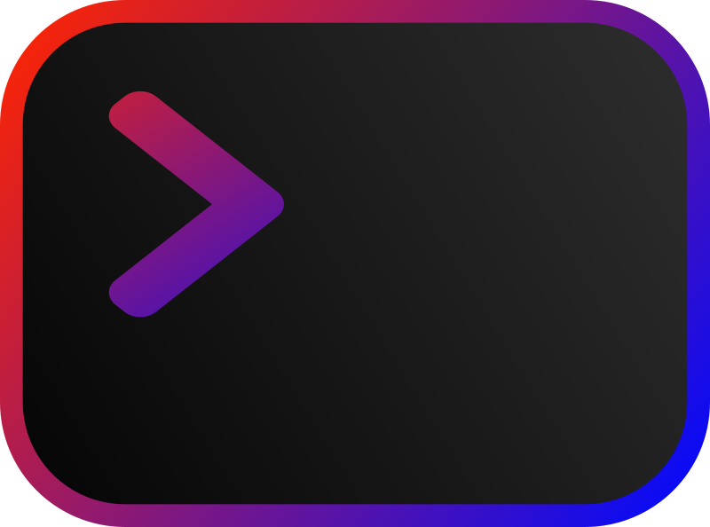

[![Stargazers][stars-shield]][stars-url]
[![Issues][issues-shield]][issues-url]
[![MIT License][license-shield]][license-url]

<!-- PROJECT LOGO -->
<br />
<p align="center">
  <a href="https://github.com/Stax124/Shell">
    
  </a>

  <h3 align="center">PyShell</h3>

  <p align="center">
    Custom shell, written in Python
    <br />
    <a href="https://github.com/Stax124/Shell/issues">Report Bug</a>
    ·
    <a href="https://github.com/Stax124/Shell/issues">Request Feature</a>
  </p>
</p>

<!-- TABLE OF CONTENTS -->
- 1. [About The Project](#AboutTheProject)
  - 1.1. [Built With](#BuiltWith)
- 2. [Getting Started](#GettingStarted)
  - 2.1. [Prerequisites](#Prerequisites)
    - 2.1.1. [Windows](#Windows)
    - 2.1.2. [Linux](#Linux)
    - 2.1.3. [Arch Linux](#ArchLinux)
  - 2.2. [Installation](#Installation)
- 3. [Usage](#Usage)
- 4. [Plugins](#Plugins)
- 5. [Compiling](#Compiling)
- 6. [Features](#Features)
  - 6.1. [Included plugins](#Includedplugins)
    - 6.1.1. [MacLookup](#MacLookup)
    - 6.1.2. [Networking](#Networking)
    - 6.1.3. [SQLite](#SQLite)
    - 6.1.4. [SSH Manager](#SSHManager)
  - 6.2. [Customization](#Customization)
- 7. [Roadmap](#Roadmap)
- 8. [Contributing](#Contributing)
- 9. [License](#License)
- 10. [Contact](#Contact)

<!-- ABOUT THE PROJECT -->

## 1. <a name='AboutTheProject'></a>About The Project

### 1.1. <a name='BuiltWith'></a>Built With

- [Prompt-toolkit](https://python-prompt-toolkit.readthedocs.io/en/master/)
- [Yapsy](https://yapsy.readthedocs.io/en/latest/)
- [PyGit](https://www.pygit2.org/)

<!-- GETTING STARTED -->

## 2. <a name='GettingStarted'></a>Getting Started

To get a local copy up and running, follow these simple steps.

### 2.1. <a name='Prerequisites'></a>Prerequisites

You will need Python and pip installed on your system. Version 3.9.0 or higher is recommended but not necessarily required.

#### 2.1.1. <a name='Windows'></a>Windows

- [Python](https://www.python.org/downloads/)

#### 2.1.2. <a name='Linux'></a>Linux

##### Debian/Ubuntu

```sh
sudo apt install python3 python3-pip
```

#### 2.1.3. <a name='ArchLinux'></a>Arch Linux

```sh
sudo pacman -S python python-pip
```

### 2.2. <a name='Installation'></a>Installation

1. Clone the repo
   ```sh
   git clone https://github.com/Stax124/Shell.git
   ```
2. Move to the project directory

   ```sh
   cd Shell
   ```

3. **OPTIONAL** Install required packages manually if automatic fails (if pip doesn't work, try pip3 instead)
   ```sh
   pip install -r requirements.txt
   ```

<!-- USAGE EXAMPLES -->

## 3. <a name='Usage'></a>Usage

Shell is invoked by running the `shell.py` file. It will try to install all the necessary modules and invoke `main.py` file.

```sh
python3 shell.py
```

`shell.py` supports argparse, so you can also run the following command:

```sh
python3 shell.py --help
```

Current shell menu should look like this:

```
usage: shell.py [-h] [-d DIRECTORY] [-v] [command ...]

positional arguments:
  command               Execute following command

optional arguments:
  -h, --help            show this help message and exit
  -d DIRECTORY, --directory DIRECTORY
                        Start in specified directory
  -v, --verbose
```

## 4. <a name='Plugins'></a>Plugins

**Shell can be extended with plugins.**

For now, included plugins are: **MacLookup, Networking, SQLite, SSH Manager**.

New plugins can be easily developed from the included template in `plugins` directory called `example`. Feel free to have a look at one of the included plugins as well for more information.

Plugins will not work if you compile the shell.

## 5. <a name='Compiling'></a>Compiling

You will need to install the following dependencies:

- PyInstaller - `pip install pyinstaller`

You can compile the shell by running the following command:

```sh
pyinstaller --onefile shell.py
```

Output will be in `dist` directory.

<!-- Features -->

## 6. <a name='Features'></a>Features

### 6.1. <a name='Includedplugins'></a>Included plugins

#### 6.1.1. <a name='MacLookup'></a>MacLookup

- Find a device type by its MAC address

#### 6.1.2. <a name='Networking'></a>Networking

- Do a quick TCP/IP scan of target. (This is just a small utility, not a full-featured network scanner like `nmap`)

#### 6.1.3. <a name='SQLite'></a>SQLite

- Connect to a SQLite database and execute queries

#### 6.1.4. <a name='SSHManager'></a>SSH Manager

- Save multiple ssh connection details and quickly connect to them

### 6.2. <a name='Customization'></a>Customization

- Customize the shell's look and feel by editing `~/.voidshell`
- All currently available public variables accessible for shell customization are
  - `RETURNCODE`
  - `DOMAIN`
  - `USER`
  - `PATH`
  - `ROOT`
  - `REPO`
  - `TIME`
  - `SYSTEM`
  - `WIN32EDITION`
  - `WIN32VER`
  - `MACOSVER`
  - `MACHINETYPE`
  - `PLATFORM`
  - `CPUCOUNT`
  - `LOGIN`
  - `PID`
  <!-- Roadmap -->

## 7. <a name='Roadmap'></a>Roadmap

- Add support for custom environments
- Add support for using brackets in commands
- Fix issue with unstable piping

See the [open issues](https://github.com/Stax124/Shell/issues) for a list of proposed features (and known issues).

<!-- CONTRIBUTING -->

## 8. <a name='Contributing'></a>Contributing

Contributions are what makes the open source community such an amazing place to learn, inspire, and create. Any contributions you make are **greatly appreciated**.

1. Fork the Project
2. Create your Feature Branch (`git checkout -b feature/AmazingFeature`)
3. Commit your Changes (`git commit -m 'Add some AmazingFeature'`)
4. Push to the Branch (`git push origin feature/AmazingFeature`)
5. Open a Pull Request

<!-- LICENSE -->

## 9. <a name='License'></a>License

Distributed under the GPL-3.0 License. See `LICENSE` for more information.

<!-- CONTACT -->

## 10. <a name='Contact'></a>Contact

Tomáš Novák - tamoncz@gmail.com

Project Link: [https://github.com/Stax124/Shell](https://github.com/Stax124/PyShell)

<!-- MARKDOWN LINKS & IMAGES -->
<!-- https://www.markdownguide.org/basic-syntax/#reference-style-links -->

[forks-shield]: https://img.shields.io/github/forks/Stax124/Shell?style=for-the-badge
[forks-url]: https://github.com/Stax124/Shell/network/members
[stars-shield]: https://img.shields.io/github/stars/Stax124/Shell?style=for-the-badge
[stars-url]: https://github.com/Stax124/Shell/stargazers
[issues-shield]: https://img.shields.io/github/issues/Stax124/Shell?style=for-the-badge
[issues-url]: https://github.com/Stax124/Shell/issues
[license-shield]: https://img.shields.io/github/license/Stax124/Shell?style=for-the-badge
[license-url]: https://github.com/Stax124/Shell/blob/master/LICENSE
